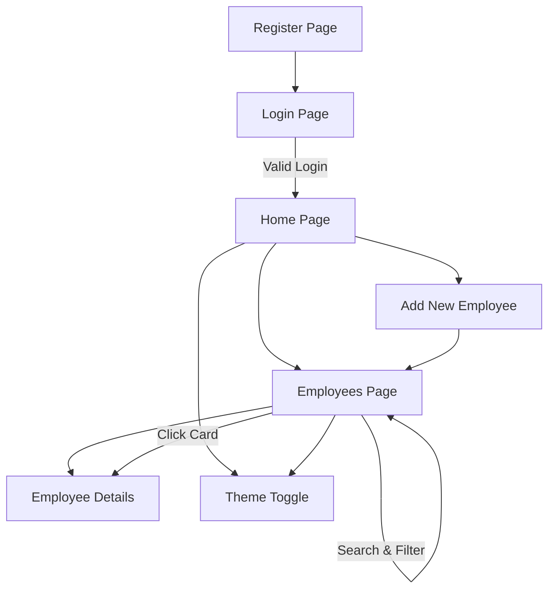

#  Employs Management System

**Stack:** React + Vite + JavaScript

```
 Developer :
    * Rafi Ullah
    * rafideveloper7@gmail.com
    * 15/09/2025
```

A simple employee management web application where users can **register, log in, and manage employee records**. Once logged in, users can access the home page, add new employees, and view employee details in a structured way.

---

##  Pages Overview

### 1️ Register Page

* User can create a new account.
* Input fields: `Name`, `Email`, `Password`.
* Data is stored and used for login authentication.

---

### 2️ Login Page

* Registered users can log in using email + password.
* On successful login → redirect to **Home Page**.
* Invalid login → show error message.

---

### 3️ Home Page

**Sections:**

* **Header**

  * Navigation bar (links: Home | Employees | Logout).

* **Main**

  * **New Employee Form Component**: Allows users to add employees with details (Name, Role, Contact, Profile Picture, etc.).
  * **Institute/Company Info Component**: Displays brief about the company/team.

* **Footer**

  * Copyright © info.
  * Useful links.

---

### 4️ Employees Page

* Displays all employees as **cards**.

* Each card contains:

  * Employee photo.
  * Name & Role.
  * "View Details" button.

* **Employee Detail Component**

  * On clicking a card/button → show full details of that employee (Name, Age, Role, Department, Contact, etc.).

---

##  Features Checklist

✅ User Registration & Login (basic auth) <br />
✅ Protected Routes (only logged-in users can access Home/Employees) <br />
✅ Add Employee (form submission → updates state/data) <br />
✅ View Employee List (cards/grid) <br />
✅ View Employee Details (dynamic route or modal popup) <br />
✅ Search & Filter employees <br />
✅ Upload profile picture for each employee <br />
✅ Persist data using **localStorage** or a simple **backend API** <br />
✅ Dark/Light theme toggle <br />
✅ Clean, modern UI with navigation <br />

---

##  Suggested Folder Structure

```
/employs-management-system
│
├── /src
│   ├── /components
│   │    ├── Header.jsx
│   │    ├── Footer.jsx
│   │    ├── EmployeeForm.jsx
│   │    ├── EmployeeCard.jsx
│   │    ├── EmployeeDetail.jsx
│   │    └── ThemeToggle.jsx
│   │
│   ├── /pages
│   │    ├── Register.jsx
│   │    ├── Login.jsx
│   │    ├── Home.jsx
│   │    └── Employees.jsx
│   │
│   ├── /utils
│   │    └── storage.js   # handles localStorage or API calls
│   │
│   ├── App.jsx
│   ├── main.jsx
│   └── index.css
│
└── package.json
```

---

##  Flow Diagram



---